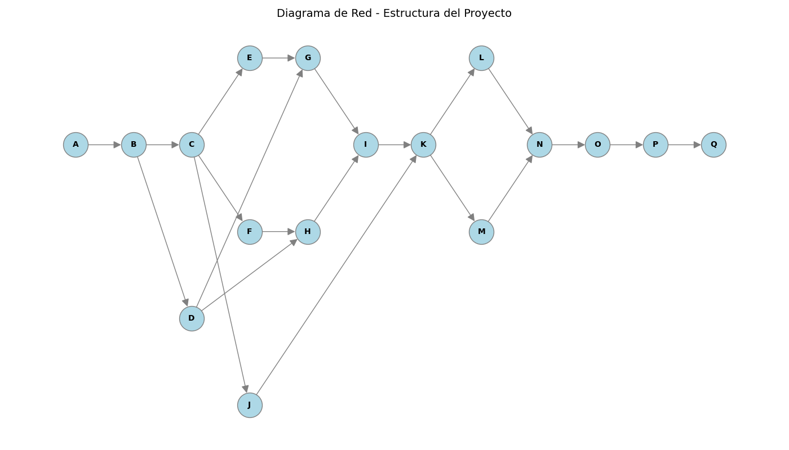
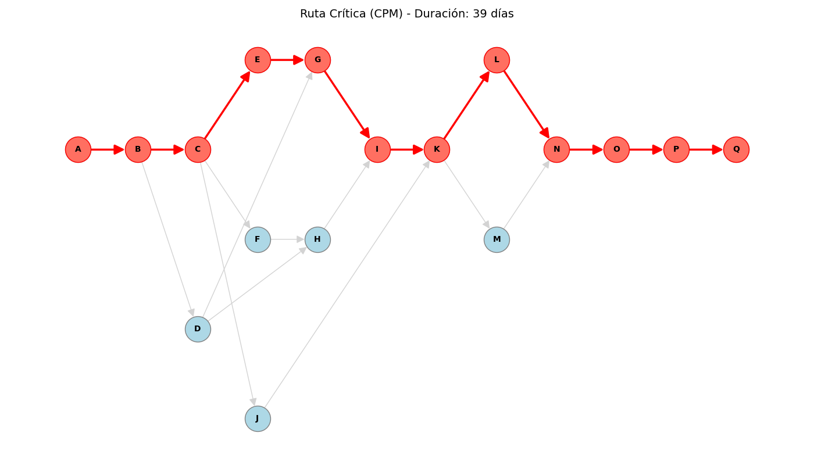

# 📱 Proyecto: Planificación de App Móvil (CPM)

Este proyecto aplica la **Teoría de Grafos** y el **Método de la Ruta Crítica (CPM)** para modelar y optimizar la planificación de un proyecto de desarrollo de software móvil, basado en el caso de estudio de la Evidencia de Aprendizaje de la Unidad 3.

[](https://colab.research.google.com/github/scysco/Essentials/blob/main/graph_theory/pj_app_tareas/pj_app_tareas.ipynb)

---

## 🎯 Contexto del Problema

Una empresa de desarrollo de software está creando una aplicación móvil de gestión de tareas personales. Para asegurar la entrega a tiempo, se requiere modelar las actividades del proyecto, sus dependencias y duraciones para identificar el camino crítico.

- **Actividades:** Desde el análisis de necesidades (A) hasta la publicación en tiendas (Q).
- **Dependencias:** Algunas tareas (como el diseño de BD o Backend) dependen de que otras (como la arquitectura) estén finalizadas.
- **Objetivo:**
  1.  Visualizar la red de actividades como un **Grafo Dirigido**.
  2.  Calcular los tiempos de inicio y fin (ES, EF, LS, LF) y la holgura de cada tarea.
  3.  Identificar la **Ruta Crítica**: la secuencia de tareas que determina la duración total mínima del proyecto.

## 💡 Solución Implementada

Se utiliza Python y la librería `NetworkX` para:

1.  **Definir el Grafo del Proyecto:** Se crea un diccionario de actividades con sus duraciones y predecesores, modelando las relaciones de dependencia.
2.  **Algoritmo CPM:** Se implementa el cálculo de "Paso Adelante" (Forward Pass) para obtener tiempos tempranos y "Paso Atrás" (Backward Pass) para tiempos tardíos y holguras.
3.  **Visualización:** Se generan gráficos que muestran la estructura completa del proyecto y resaltan visualmente la ruta crítica y las actividades sin holgura.

## 📊 Resultado

El análisis genera visualizaciones clave para la gestión del proyecto:

### 1. Diagrama de Red (Estructura)



### 2. Ruta Crítica Identificada



_(Los nodos en rojo representan las actividades críticas que no pueden retrasarse sin afectar la fecha de entrega final)._

---

## 🛠️ Tecnologías y Librerías


---

## 🚀 Cómo Ejecutar Localmente

1.  **Clonar el repositorio.**
2.  **Activar entorno virtual:**
    ```bash
    source .venv/bin/activate  # Linux/Mac
    # .venv\Scripts\activate   # Windows
    ```
3.  **Instalar dependencias:**
    ```bash
    pip install networkx matplotlib
    ```
4.  **Ejecutar el script:**
    ```bash
    python graph_app_tareas.py
    ```
    Esto generará las imágenes `diagrama_base.png` y `diagrama_critico.png` en la misma carpeta.
