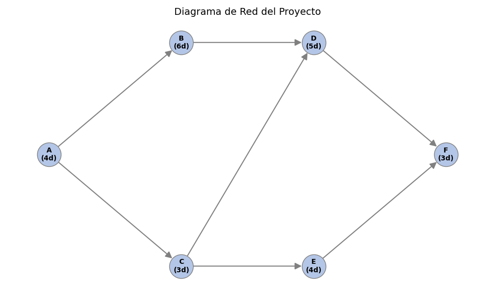
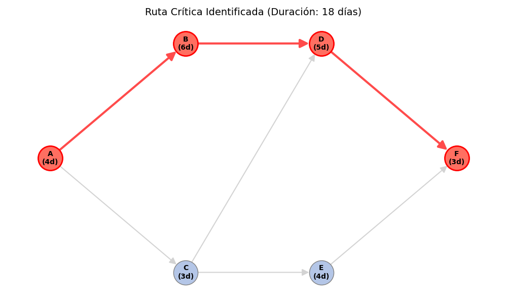

# 🏠 Proyecto: SmartHome Systems (CPM)

Este proyecto utiliza la **Teoría de Grafos** y el **Método de la Ruta Crítica (CPM)** para optimizar la planificación del proyecto de integración de un sistema domótico inteligente, basado en el caso de estudio de la Actividad Complementaria de la Unidad 3.

[](https://colab.research.google.com/github/scysco/Essentials/blob/main/graph_theory/pj_smart_home/pj_smart_home.ipynb)

---

## 🎯 Contexto del Problema

La empresa "SmartHome Systems" está desarrollando un sistema para controlar sensores IoT (temperatura, luz, seguridad). Para garantizar el lanzamiento comercial a tiempo, el gerente necesita analizar la secuencia de integración de los módulos.

- **El Desafío:** Determinar la duración total del proyecto y qué actividades no pueden retrasarse.
- **Actividades:** 6 tareas clave, desde el diseño de protocolos (A) hasta la integración final (F).
- **Dependencias:** Complejas interrelaciones (ej. las pruebas de compatibilidad 'D' dependen de los módulos de conversión 'B' y configuración 'C').

## 💡 Solución Implementada

Se utiliza Python y la librería `NetworkX` para modelar el cronograma como un **Grafo Dirigido Aclíclico (DAG)**:

1.  **Modelado de Tareas:** Cada nodo representa una actividad con su duración (en días). Las aristas representan las dependencias (predecesores).
2.  **Cálculo de Tiempos:** Se implementan algoritmos para calcular:
    - **Inicio/Fin Temprano (ES/EF):** Lo más pronto que puede empezar una tarea.
    - **Inicio/Fin Tardío (LS/LF):** Lo más tarde que puede empezar sin retrasar el proyecto.
    - **Holgura:** El margen de tiempo disponible.
3.  **Ruta Crítica:** Identificación de la secuencia de tareas con **holgura cero** que determina la fecha de entrega.

## 📊 Resultado

El análisis genera visualizaciones que permiten al gerente ver el flujo de trabajo y los cuellos de botella:

### 1. Grafo del Proyecto (Dependencias)



### 2. Ruta Crítica (Actividades Prioritarias)



_(Las actividades en rojo, como A->B->D->F, deben ser monitoreadas estrictamente)._

---

## 🛠️ Tecnologías y Librerías


---

## 🚀 Cómo Ejecutar Localmente

1.  **Clonar el repositorio.**
2.  **Activar entorno virtual:**
    ```bash
    source .venv/bin/activate  # Linux/Mac
    # .venv\Scripts\activate   # Windows
    ```
3.  **Instalar dependencias:**
    ```bash
    pip install networkx matplotlib
    ```
4.  **Ejecutar el script:**
    ```bash
    python graph_smart_home.py
    ```
    Esto generará las imágenes del grafo base y la ruta crítica en la carpeta actual.
