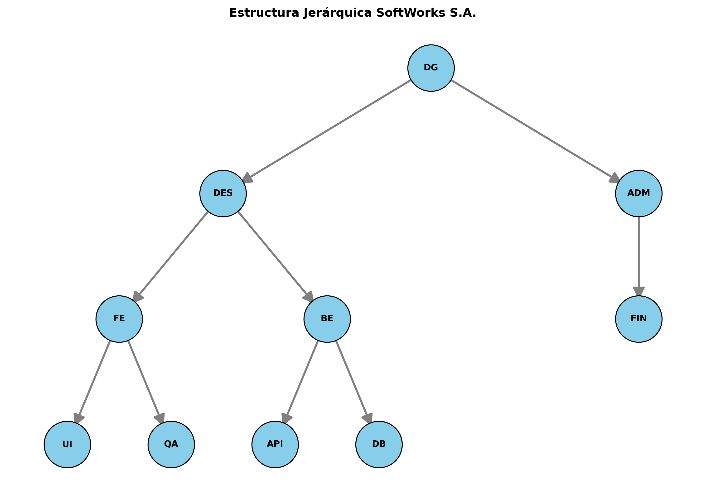
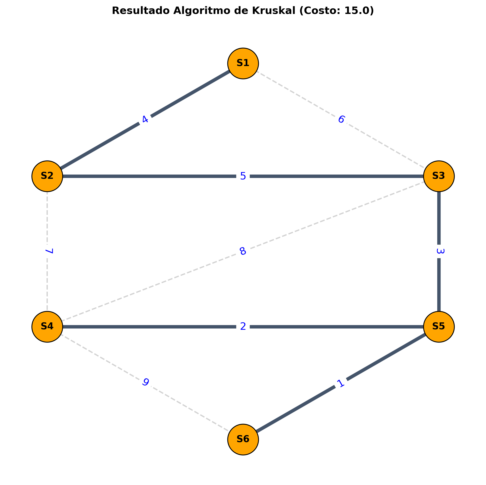

# 🏢 Proyecto: Red de Optimización "SoftWorks S.A."

Este proyecto modela la estructura organizacional y la red de servidores de una empresa de desarrollo de software utilizando Teoría de Grafos, basado en un caso de estudio de la materia Matemáticas Discretas.

[](https://colab.research.google.com/github/scysco/Essentials/blob/main/graph_theory/pj_softworks/pj_softworks.ipynb)

---

## 🎯 Contexto del Problema

El caso de estudio presenta dos desafíos distintos para la empresa "SoftWorks S.A.":

1. **Estructura Organizacional:** Modelar la jerarquía de la empresa para visualizar las líneas de mando y supervisión.
    - **Nodos:** Departamentos y áreas (e.g., Dirección General `DG`, Desarrollo `DES`, Finanzas `FIN`).
    - **Aristas (Dirigidas):** Relaciones de autoridad (quién supervisa a quién).

2. **Infraestructura de Red:** Optimizar el costo de cableado de fibra óptica para interconectar los servidores principales.
    - **Nodos:** Servidores (`S1` a `S6`).
    - **Aristas (Ponderadas):** Costos de conexión en miles de pesos.
    - **Objetivo:** Encontrar el Árbol de Expansión Mínima (MST) para conectar todo con el menor costo.

## 💡 Solución Implementada

Se utiliza la librería `NetworkX` de Python para modelar ambos escenarios:

- Un **Grafo Dirigido (DiGraph)** para el organigrama.
- Un **Grafo No Dirigido (Graph)** para la red de servidores, aplicando el algoritmo de **Kruskal** para calcular el MST.

El script `graph_softworks.py` genera visualizaciones automáticas de estas estructuras usando `Matplotlib`.

---

## 📊 Resultado

El script genera visualizaciones como las siguientes:

### 1. Organigrama Jerárquico



### 2. Red Óptima de Servidores (MST)



---

## 🛠️ Tecnologías y Librerías


---

## 🚀 Cómo Ejecutar Localmente

1. **Clonar el repositorio (o esta carpeta).**

2. **Crear un entorno virtual:**

    ```bash
    virtualenv .venv
    ```

3. **Activar el entorno:**
    _En Nushell:_

    ```nu
    overlay use .venv/bin/activate.nu
    ```

    _En Bash/Zsh:_

    ```bash
    source .venv/bin/activate
    ```

4. **Instalar dependencias:**

    ```bash
    pip install networkx matplotlib
    ```

5. **Ejecutar el script:**

    ```bash
    python graph_softworks.py
    ```

    Esto generará los archivos `.png` con los gráficos en la misma carpeta.
