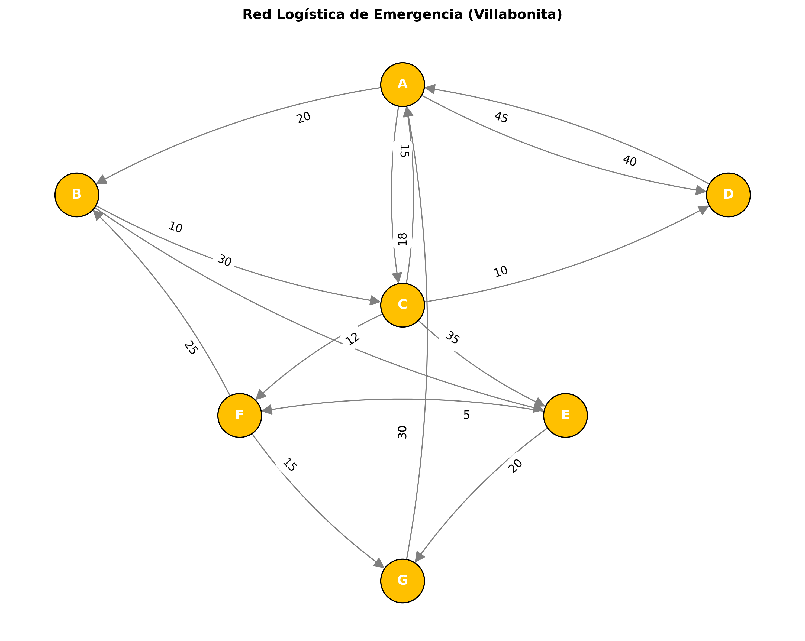

# 🚑 Proyecto: Red de Emergencia "Villabonita" (Dijkstra)

Este proyecto modela una red logística de emergencia para una ciudad afectada por inundaciones, utilizando **Grafos Dirigidos Ponderados** y el **Algoritmo de Dijkstra**, basado en el Caso de Estudio U3 A3 de Matemáticas Discretas.

[](https://colab.research.google.com/github/scysco/Essentials/blob/main/graph_theory/pj_villabonita/pj_villabonita.ipynb)

---

## 🎯 Contexto del Problema

La ciudad de "Villabonita del Grijalva" ha sufrido inundaciones catastróficas. La infraestructura vial está comprometida y muchas calles son de un solo sentido o están bloqueadas.

El "Comité de Protección Civil Municipal" (CPCM) necesita optimizar la distribución de suministros desde un **Centro de Acopio (Nodo A)** hacia 6 refugios y colonias (B, C, D, E, F, G).

- **El Desafío:** Encontrar las **rutas más rápidas** (tiempo mínimo) desde el nodo origen (A) hacia todos los demás puntos, considerando que las vías tienen dirección única y tiempos de viaje variables.
- **Estructura:** Grafo Dirigido Ponderado.
  - **Nodos:** Ubicaciones (A, B, C...).
  - **Aristas:** Rutas viables.
  - **Pesos:** Tiempo en minutos.

## 💡 Solución Implementada

Se utiliza Python y `NetworkX` para:

1.  **Modelar la Red:** Crear un `DiGraph` (Grafo Dirigido) con los pesos (tiempos) especificados en el caso de estudio.
2.  **Calcular Rutas Óptimas:** Aplicar el **Algoritmo de Dijkstra** para determinar el tiempo mínimo y el camino exacto desde el Centro de Acopio (A) hacia cada refugio.
3.  **Visualización:** Generar un mapa visual de la red y resaltar las rutas críticas.

## 📊 Resultado

El análisis genera el plan de rutas óptimo y visualizaciones como:

### Red Logística de Emergencia



_(El script calcula, por ejemplo, que la ruta más rápida de A a G no es directa, sino A->C->F->G con un tiempo total específico)._

---

## 🛠️ Tecnologías y Librerías


---

## 🚀 Cómo Ejecutar Localmente

1.  **Clonar el repositorio.**
2.  **Activar entorno virtual:**
    ```bash
    source .venv/bin/activate  # Linux/Mac
    # .venv\Scripts\activate   # Windows
    ```
3.  **Instalar dependencias:**
    ```bash
    pip install networkx matplotlib
    ```
4.  **Ejecutar el notebook:**
    Abre `pj_villabonita.ipynb` en tu editor favorito o ejecuta el script de generación si está disponible.
