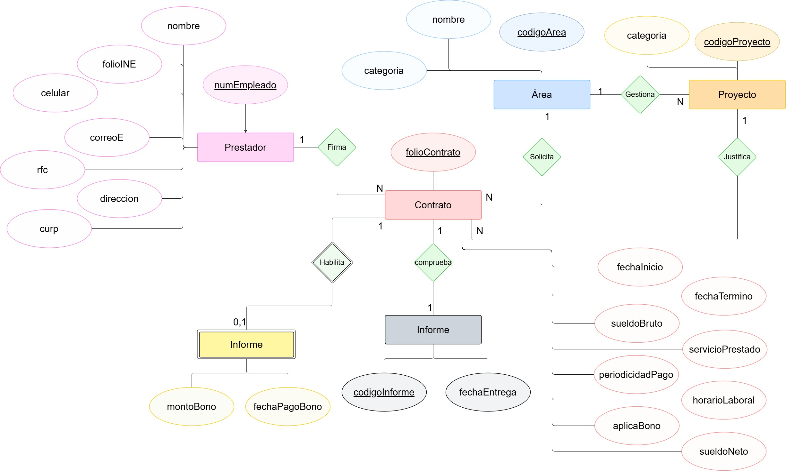

# 🗃️ Proyecto: Modelo E-R "Contrataciones Congreso"

Este proyecto consiste en el diseño de un **Modelo Entidad-Relación (E-R)** para un sistema de gestión de contrataciones de prestadores de servicios profesionales. Está basado en un caso de estudio de la materia de Base de Datos.

El modelo se ha diseñado utilizando la **Notación de Peter Chen**.

---

## 🎯 Contexto del Problema

El congreso local necesita un sistema para gestionar la contratación de prestadores de servicios profesionales que colaboran en diversos proyectos legislativos.

El sistema debe registrar la información de:

- **Prestador:** Datos personales y de contacto.
- **Área:** Áreas del congreso a las que se asignan (Servicios Parlamentarios, Unidad de Género, etc.).
- **Proyecto:** Proyectos específicos en los que colabora el prestador.
- **Contrato:** El documento legal que vincula al prestador, un área y un proyecto, con detalles de pago y vigencia.
- **Informe:** Entregables que comprueban el servicio.
- **Bono:** Pagos extra opcionales asociados a un contrato.

## 💡 Modelo Entidad-Relación (Notación Chen)

El siguiente diagrama modela las entidades, sus atributos y las relaciones de cardinalidad entre ellas para satisfacer los requisitos del sistema.

### Entidades Identificadas

- **Prestador**
- **Área**
- **Proyecto**
- **Contrato**
- **Informe**
- **Bono**

---

## 🛠️ Herramientas

