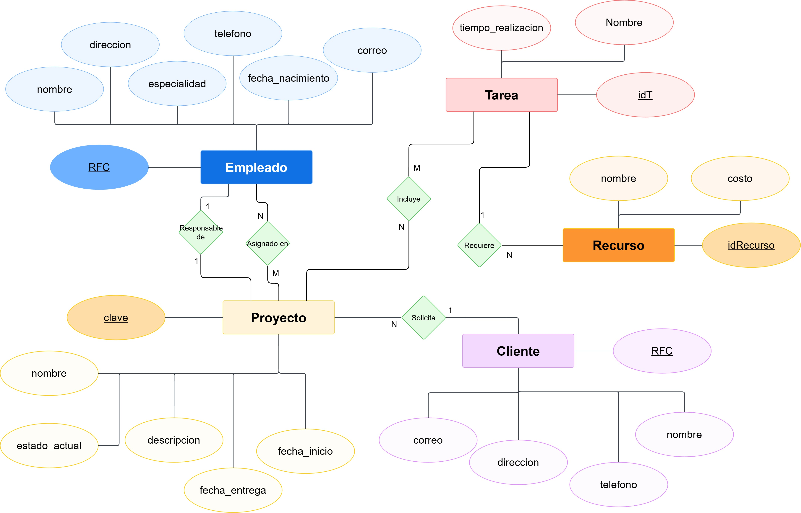

# 🗃️ Proyecto: Modelo E-R "Gestión de Proyectos TECNORES"

Este proyecto consiste en el diseño de un **Modelo Entidad-Relación (E-R)** para un sistema de seguimiento y control de proyectos en la empresa de consultoría TI "TECNORES". Está basado en un caso de estudio de la materia de Base de Datos.

El modelo se ha diseñado utilizando la **Notación de Peter Chen**.

---

## 🎯 Contexto del Problema

La empresa "TECNORES" enfrenta un control deficiente de sus proyectos, lo que causa retrasos en las entregas. La gestión actual se realiza en hojas de cálculo, dificultando el seguimiento de puntos críticos.

Se requiere implementar una base de datos para llevar un control eficiente de los proyectos, permitiendo registrar y consultar:

- **Empleados:** Con sus datos personales y especialidad.
- **Clientes:** Que solicitan los proyectos.
- **Proyectos:** Con sus fechas, estado actual y responsable.
- **Actividades/Tareas:** Que componen cada proyecto.
- **Recursos:** Materiales o de software asignados a las actividades.
- **Relaciones:** Como la asignación de empleados a proyectos, el responsable de un proyecto, etc.

## 💡 Modelo Entidad-Relación (Notación Chen)

El siguiente diagrama modela las entidades, sus atributos y las relaciones de cardinalidad entre ellas para satisfacer los requisitos del sistema.

### Entidades Identificadas

- **Empleado**
- **Proyecto**
- **Cliente**
- **Actividad** (o Tarea)
- **Recurso** (o Material)
- **Estado_Proyecto** (Registro diario del estado)

---

## 🛠️ Herramientas

