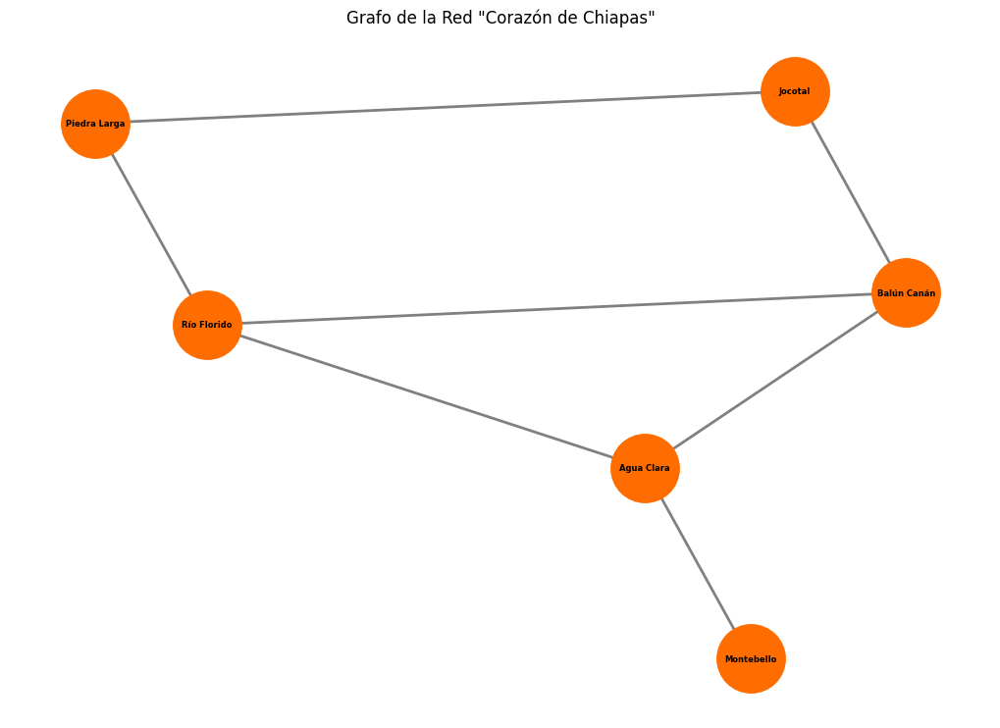

# 🗺️ Proyecto: Red de Distribución "Corazón de Chiapas"

Este proyecto modela una red de distribución logística utilizando Teoría de Grafos, basado en un caso de estudio de la materia Matemáticas Discretas.

[](https://colab.research.google.com/github/scysco/Essentials/blob/main/graph_theory/pj_chiapas/pj_chiapas.ipynb)

---

## 🎯 Contexto del Problema

Basado en el caso de estudio "Red de distribución de artesanías Corazón de Chiapas", se presenta un desafío logístico para una cooperativa social. El objetivo es optimizar la recolección de productos desde varias comunidades artesanas y llevarlos a un centro de acopio principal en "Balún Canán".

- **Nodos (Vértices):** Las localidades.
  - `BC`: Balún Canán (Centro de Acopio)
  - `J`: Jocotal
  - `PL`: Piedra Larga
  - `RF`: Río Florido
  - `AC`: Agua Clara
  - `M`: Montebello
- **Aristas (Ejes):** Las conexiones viales directas (doble sentido) entre ellas.

El problema consiste en modelar esta red para entender visualmente las conexiones existentes.

## 💡 Solución Implementada

Se utiliza la librería `NetworkX` de Python para modelar esta red como un **Grafo No Dirigido (Undirected Graph)**. El script `graph_corazon_de_chiapas.py` define los nodos y las aristas según el caso de estudio y utiliza `Matplotlib` para generar una visualización de la red.

El layout `kamada_kawai_layout` (que requiere `SciPy`) se utiliza para organizar los nodos de una manera estéticamente agradable y clara.

---

## 📊 Resultado

El script genera la siguiente visualización de la red:



---

## 🛠️ Tecnologías y Librerías


---

## 🚀 Cómo Ejecutar Localmente

1.  **Clonar el repositorio (o esta carpeta).**

2.  **Crear un entorno virtual:**

    ```bash
    virtualenv .venv
    ```

3.  **Activar el entorno:**
    _En Nushell:_

    ```nu
    overlay use .venv/bin/activate.nu
    ```

    _En Bash/Zsh:_

    ```bash
    source .venv/bin/activate
    ```

4.  **Instalar dependencias:**
    El archivo `requirements.txt` contiene todas las librerías necesarias.

    ```bash
    pip install -r requirements.txt
    ```

5.  **Ejecutar el script:**
    ```bash
    python graph_corazon_de_chiapas.py
    ```
    Esto generará el archivo `grafo_corazon_chiapas.png` en la misma carpeta.
