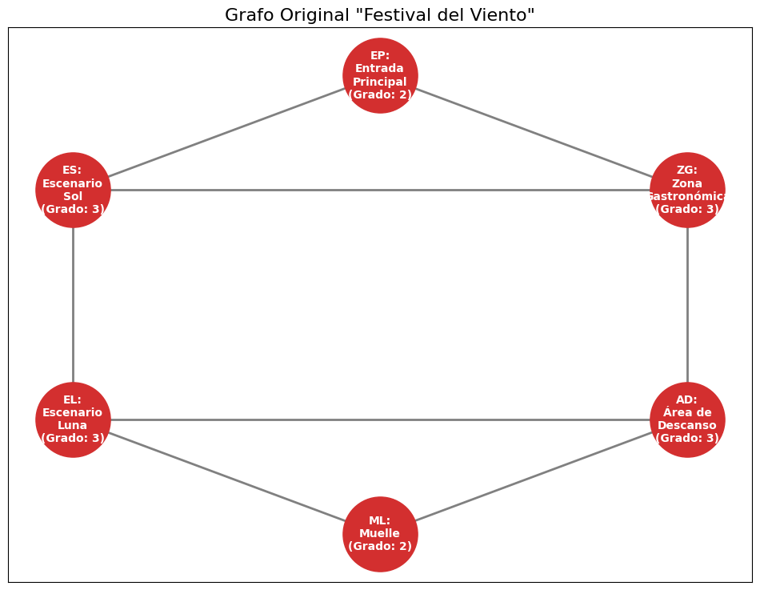
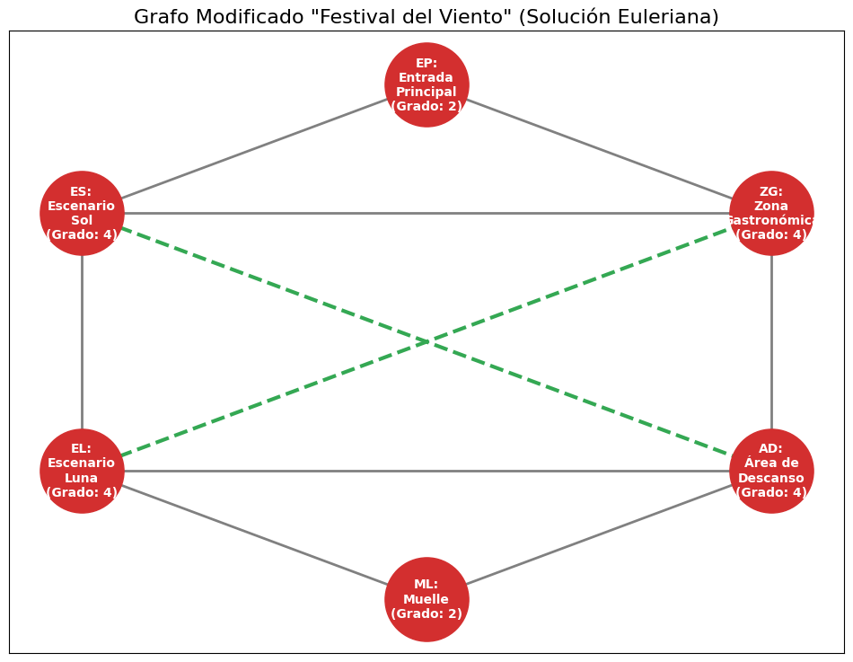

# 🛤️ Proyecto: Rutas de Patrullaje "Festival del Viento"

Este proyecto analiza la viabilidad de una ruta de patrullaje óptima en un festival utilizando la **Teoría de Grafos**, específicamente el concepto de **Circuitos Eulerianos**. Está basado en el caso de estudio "Festival del Viento" de la materia Matemáticas Discretas.

[](https://colab.research.google.com/github/scysco/Essentials/blob/main/graph_theory/pj_rutas_festival/pj_rutas_festival.ipynb)

---

## 🎯 Contexto del Problema

La coordinadora del "Festival del Viento" necesita diseñar una ruta de patrullaje que permita a un guardia **recorrer cada sendero del festival exactamente una vez y regresar al punto de inicio**. Este es un problema clásico de **Circuito Euleriano**.

- **Nodos (Zonas):**
  - `EP`: Entrada Principal
  - `ES`: Escenario Sol
  - `ZG`: Zona Gastronómica
  - `EL`: Escenario Luna
  - `AD`: Área de Descanso
  - `ML`: Muelle
- **Aristas (Senderos):** Los 8 senderos que conectan las zonas.

Para que dicho circuito exista, **todos los nodos (zonas) del grafo deben tener un grado par** (un número par de senderos conectados a ellos).

## 💡 Solución Implementada

Se utiliza `NetworkX` para modelar el festival como un **Grafo No Dirigido (Undirected Graph)**. El script `graph_festival.py` realiza dos análisis:

1. **Análisis del Grafo Original:**
    - Se construye el grafo según el caso de estudio.
    - Se calcula el **grado de cada nodo**.
    - Se verifica que el grafo original **no es Euleriano** porque tiene 4 nodos con grado impar (`ES`, `ZG`, `EL`, `AD`).

2. **Propuesta de Modificación:**
    - Para solucionar el problema, se propone una modificación de bajo costo: **añadir un nuevo sendero**.
    - El script simula la adición de un sendero entre la **Zona Gastronómica (`ZG`)** y el **Escenario Luna (`EL`)**.
    - Se recalcula el grado de los nodos y se demuestra que el **grafo modificado sí es Euleriano**, ya que todos sus nodos pasan a tener grado par.

---

## 📊 Resultados

### Grafo Original (No Euleriano)

_Nodos con grado impar (en rojo) impiden el circuito._


### Grafo Modificado (Sí Euleriano)

_Al añadir el sendero ZG-EL (en azul), todos los nodos tienen grado par._


---

## 🛠️ Tecnologías y Librerías


---

## 🚀 Cómo Ejecutar Localmente

1. **Clonar el repositorio (o esta carpeta).**

2. **Crear un entorno virtual:**

    ```bash
    virtualenv .venv
    ```

3. **Activar el entorno:**
    _En Nushell (tu shell):_

    ```nu
    overlay use .venv/bin/activate.nu
    ```

    _En Bash/Zsh:_

    ```bash
    source .venv/bin/activate
    ```

4. **Instalar dependencias:**
    _(Este proyecto no requiere `scipy`)_

    ```bash
    pip install networkx matplotlib
    ```

5. **Ejecutar el script:**

    ```bash
    python graph_festival.py
    ```

    Esto generará los dos archivos `.png` en la misma carpeta.
