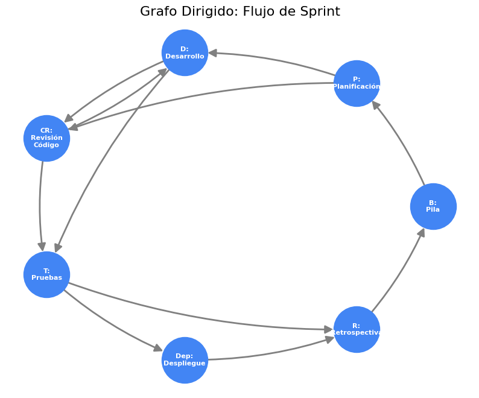
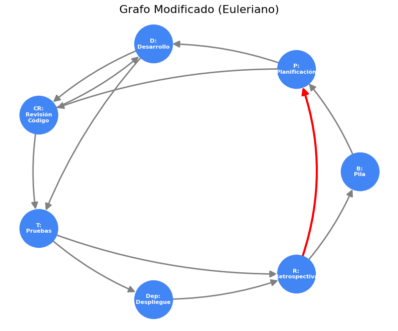

# 🏃 Proyecto: Modelado de Flujo de Sprint (Scrum)

Este proyecto modela el flujo de trabajo de un sprint de desarrollo ágil (Scrum) como un **Grafo Dirigido (DiGraph)**, basado en un caso de estudio de la materia Matemáticas Discretas.

[](https://colab.research.google.com/github/scysco/Essentials/blob/main/graph_theory/pj_sprint/pj_sprint.ipynb)

---

## 🎯 Contexto del Problema

El caso de estudio describe el desarrollo de una API REST para gestión de inventarios. El equipo usa Scrum, y su flujo de trabajo se puede representar con nodos (fases) y aristas (transiciones).

- **Nodos (Fases):**
  - `B`: Pila de Producto (Backlog)
  - `P`: Planificación (Planning)
  - `D`: Desarrollo (Development)
  - `CR`: Revisión de Código (Code Review)
  - `T`: Pruebas (Testing)
  - `Dep`: Despliegue (Deployment)
  - `R`: Retrospectiva (Retrospective)
- **Aristas (Transiciones):** Flujos de trabajo, dependencias y ciclos de re-trabajo entre las fases.

El objetivo es modelar este flujo, calcular los **grados de entrada (in-degree)** y **grados de salida (out-degree)** de cada fase, y visualizar tanto el flujo original como uno modificado.

## 💡 Solución Implementada

Se utiliza `NetworkX` para crear un `DiGraph`. El script `graph_sprint.py` implementa dos visualizaciones:

1. **Grafo Original:** Modela el flujo de trabajo descrito en el caso de estudio.
2. **Grafo Modificado:** Simula un cambio en el proceso, añadiendo una nueva fase de **Monitoreo (`M`)** y una nueva transición de **Retrospectiva (`R`)** de vuelta a **Planificación (`P`)**.

En ambas visualizaciones, las etiquetas de los nodos se personalizan para mostrar:

- Nombre de la fase
- Grado de Entrada (Conexiones que recibe)
- Grado de Salida (Conexiones que emite)

---

## 📊 Resultados

El script genera dos visualizaciones para comparar el flujo de trabajo.

### Grafo del Flujo Original



### Grafo del Flujo Modificado

_(Con el nodo "M" (Monitoreo) y la arista R -> P)_


---

## 🛠️ Tecnologías y Librerías


---

## 🚀 Cómo Ejecutar Localmente

1. **Clonar el repositorio (o esta carpeta).**

2. **Crear un entorno virtual:**

    ```bash
    virtualenv .venv
    ```

3. **Activar el entorno:**
    _En Nushell (tu shell):_

    ```nu
    overlay use .venv/bin/activate.nu
    ```

    _En Bash/Zsh:_

    ```bash
    source .venv/bin/activate
    ```

4. **Instalar dependencias:**
    _(Este proyecto no requiere `scipy`)_

    ```bash
    pip install networkx matplotlib
    ```

5. **Ejecutar el script:**

    ```bash
    python graph_sprint.py
    ```

    Esto generará los dos archivos `.png` en la misma carpeta.
