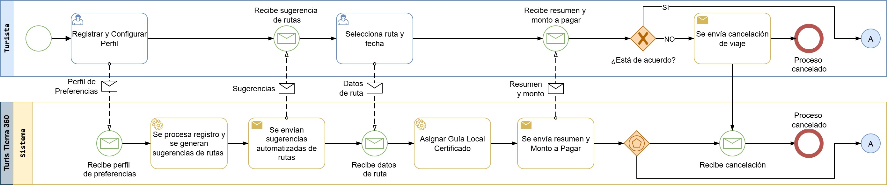
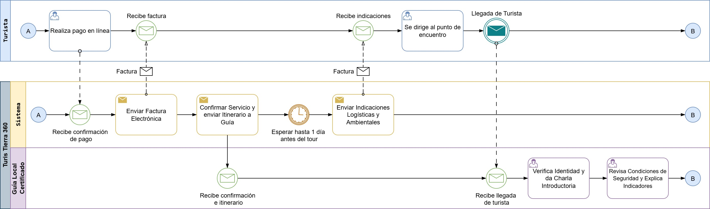
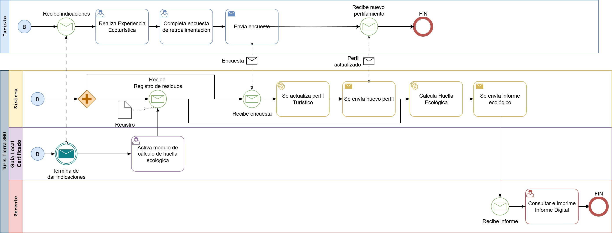
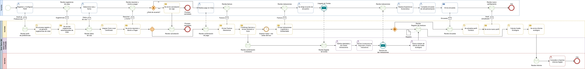
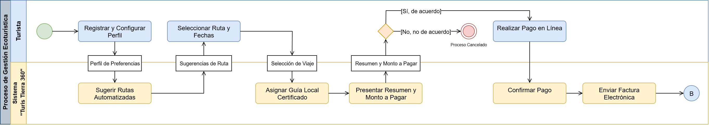
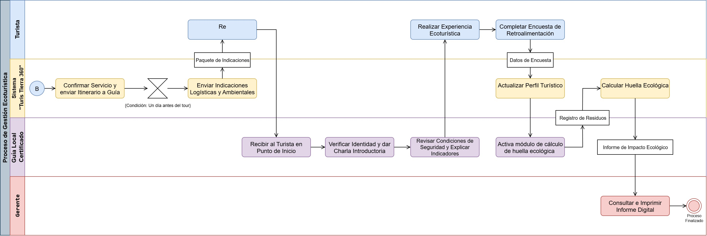
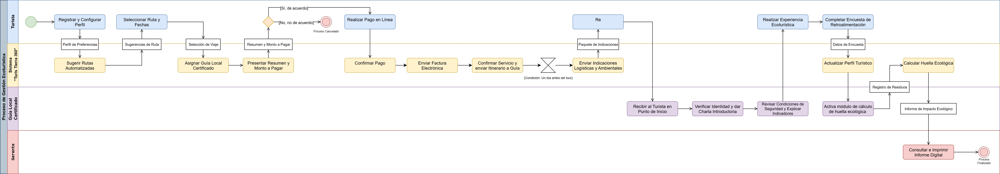
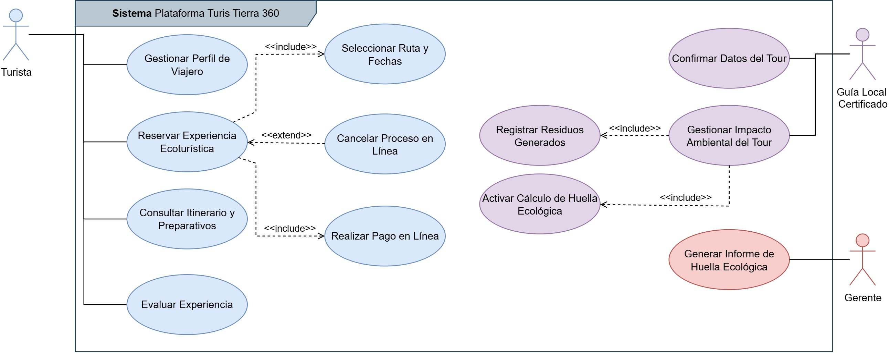

# 📂 Actividad Complementaria: Modelado Integral "Turis Tierra 360"

Este directorio contiene el desarrollo de la **Actividad Complementaria** de la Unidad 4 para la asignatura **Modelado de Negocios**. El proyecto consiste en un modelado completo y multifacético del caso de estudio "Turis Tierra 360", utilizando los estándares BPMN y UML para obtener una visión integral del negocio.

---

## 📊 Diagrama de Procesos de Negocio (BPMN)

Este diagrama modela el flujo de trabajo operativo completo de la gestión de una experiencia ecoturística. Utiliza un enfoque de dos pools para diferenciar la interacción del `Turista` (participante externo) del proceso interno de la organización.

### Vista Detallada del Proceso

Para facilitar la visualización, el proceso se ha dividido en tres partes:

1. **Inicio y Reservación:**
    
2. **Ejecución del Tour:**
    
3. **Cierre y Reporte:**
    

### Vista Completa del Proceso

---

## UML: Diagrama de Actividades

Este diagrama se enfoca en las responsabilidades y la transferencia de control entre los diferentes roles de la organización (`Turista`, `Sistema`, `Guía Local` y `Gerente`) a través de carriles (swimlanes).

### Vista Detallada del Flujo

1. **Fase de Planeación y Pago:**
    
2. **Fase de Ejecución y Cierre:**
    

### Vista Completa del Flujo

---

## UML: Diagrama de Casos de Uso

Este modelo describe la funcionalidad que el sistema "Turis Tierra 360" ofrece a sus diferentes actores, definiendo los objetivos que cada uno puede lograr y las relaciones entre estas funcionalidades.

---

## 🛠️ Herramientas Utilizadas

- **Diagramación:** [Draw.io](https://app.diagrams.net/) (diagrams.net)
- **Estándares:** BPMN 2.0 y UML 2.5

---

## 👨‍💻 Autor

- **Francisco Sánchez Manuel**

